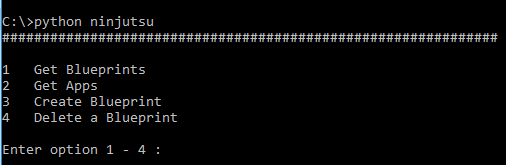

# *Ninjutsu*
Console based, Menu Driven, Driver for testing various HyperGrid API's. 

##  Requirements ##
    Windows   - Python 2.7.0 - 2.7.15.
    Linux/Mac - Python 2.7.9 - 2.7.15. - The default on most OS's today

##  Usage ##
    > git clone https://github.com/suntosh/ninjutsu.git ninjutsu

    execute staying in the parent directory of the cloned directory

    > python ninjutsu

##  Configuration ##
    Feel free to hack globals.py at your own risk 
